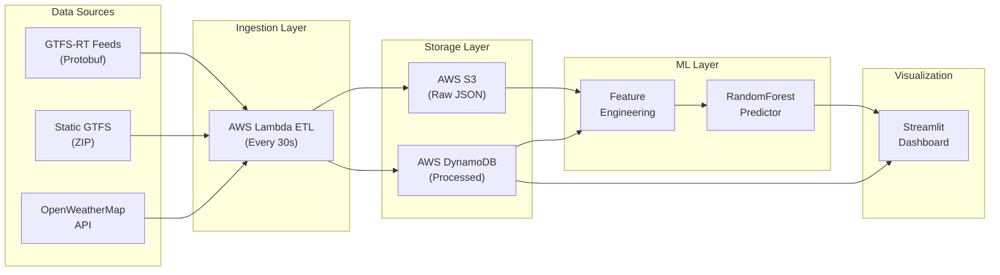

# Edmonton Transit System Real-Time Analytics Dashboard

[](https://www.python.org/)
[](https://aws.amazon.com/)
[](https://streamlit.io/)
[](LICENSE)

A production-grade real-time analytics system that tracks Edmonton Transit System (ETS) performance. This project demonstrates end-to-end Data Engineering, Data Science, and Data Analysis capabilities in a single portfolio application.

##  Live Demo

**Dashboard URL:** https://ysdhimself-transit-analytics-dashboard-dashboardapp-x0lasd.streamlit.app/

##  Project Overview

This system:
- **Ingests** live GTFS-RT transit data every 30 seconds via AWS Lambda
- **Processes** and validates data with automated quality checks
- **Stores** raw data in S3 and processed records in DynamoDB
- **Predicts** bus arrival delays using Random Forest ML model (R² ≥ 0.75)
- **Visualizes** insights through an interactive Streamlit dashboard with real-time updates

##  Architecture



##  Features

### Data Engineering
- ✅ Serverless ETL pipeline with AWS Lambda
- ✅ Real-time GTFS-RT protobuf parsing
- ✅ Automated data quality validation and deduplication
- ✅ S3 data lake with date-based partitioning
- ✅ DynamoDB for fast dashboard queries

### Data Science
- ✅ Feature engineering with temporal and route features
- ✅ Random Forest model for delay prediction
- ✅ Model evaluation with R², MAE, and accuracy metrics
- ✅ Serialized model serving with joblib

### Data Analysis & Visualization
- ✅ Real-time KPI cards (Active Buses, Avg Delay, On-Time Rate)
- ✅ Interactive delay heatmap (route × hour)
- ✅ Route performance ranking with bar charts
- ✅ Live vehicle position map with color-coded delays
- ✅ Auto-refresh every 30 seconds

##  Tech Stack

| Layer | Technologies |
|-------|-------------|
| **Data Ingestion** | AWS Lambda, EventBridge, GTFS-RT (Protobuf) |
| **Storage** | AWS S3, DynamoDB |
| **Processing** | Python, Pandas, NumPy |
| **Machine Learning** | Scikit-learn, XGBoost, Joblib |
| **Visualization** | Streamlit, Plotly, PyDeck |
| **CI/CD** | GitHub Actions, AWS SAM |
| **APIs** | Edmonton Open Data Portal, OpenWeatherMap |

##  Project Structure

```
transit-analytics-dashboard/
├── src/
│   ├── ingestion/          # GTFS-RT parsing, validation, S3/DynamoDB writers
│   ├── processing/         # Static GTFS loader, delay calculation, feature engineering
│   ├── ml/                 # Model training and prediction serving
│   └── utils/              # Config, weather API client
├── dashboard/
│   ├── app.py              # Main Streamlit application
│   ├── components/         # KPI cards, heatmap, route performance, live map
│   └── data_loader.py      # Data fetching with caching
├── tests/                  # Unit tests for all modules
├── .github/workflows/      # CI/CD pipeline
├── template.yaml           # AWS SAM deployment template
├── requirements.txt        # Python dependencies
└── README.md
```

##  Quick Start

### Prerequisites

- Python 3.11+
- AWS Account (free tier eligible)
- Git

### Installation

1. **Clone the repository**
   ```bash
   git clone https://github.com/yourusername/transit-analytics-dashboard.git
   cd transit-analytics-dashboard
   ```

2. **Create virtual environment**
   ```bash
   python -m venv venv
   source venv/bin/activate  # On Windows: venv\Scripts\activate
   ```

3. **Install dependencies**
   ```bash
   pip install -r requirements.txt
   ```

4. **Set up environment variables**
   ```bash
   cp .env.example .env
   # Edit .env with your AWS credentials
   ```

### Running Locally

**Option 1: Dashboard Only (with mock data)**
```bash
streamlit run dashboard/app.py
```

**Option 2: Full Pipeline**

1. **Download static GTFS data**
   ```bash
   python -m src.processing.static_gtfs_loader
   ```

2. **Test GTFS-RT ingestion**
   ```bash
   python -m src.ingestion.gtfs_rt_parser
   ```

3. **Run Lambda handler locally**
   ```bash
   python -m src.ingestion.lambda_handler
   ```

4. **Launch dashboard**
   ```bash
   streamlit run dashboard/app.py
   ```

## ☁️ AWS Deployment

### Option 1: AWS SAM (Recommended)

```bash
# Install SAM CLI: https://docs.aws.amazon.com/serverless-application-model/latest/developerguide/install-sam-cli.html

# Build and deploy
sam build
sam deploy --guided
```

### Option 2: Manual AWS CLI

```bash
# Create S3 bucket
aws s3 mb s3://ets-transit-data

# Create DynamoDB table
aws dynamodb create-table \
  --table-name ets_transit_processed \
  --attribute-definitions AttributeName=pk,AttributeType=S AttributeName=sk,AttributeType=S \
  --key-schema AttributeName=pk,KeyType=HASH AttributeName=sk,KeyType=RANGE \
  --billing-mode PAY_PER_REQUEST

# Package Lambda
./deploy-lambda.sh
```

### Streamlit Cloud Deployment

1. Push code to GitHub
2. Go to [streamlit.io/cloud](https://streamlit.io/cloud)
3. Connect your repository
4. Set secrets in Streamlit Cloud UI:
   - `aws.AWS_ACCESS_KEY_ID`
   - `aws.AWS_SECRET_ACCESS_KEY`
   - etc. (see `.streamlit/secrets.toml` format in docs)
5. Deploy!

##  Testing

```bash
# Run all tests
pytest tests/ -v

# Run with coverage
pytest tests/ --cov=src --cov-report=html

# Run specific test module
pytest tests/test_ingestion.py -v
```

##  Machine Learning Model

### Training the Model

```bash
# 1. Collect data (run ingestion for several hours/days)
# 2. Export trip updates to CSV
# 3. Train model

python -m src.ml.train_model
```

### Model Performance Targets

- **R² Score:** ≥ 0.75
- **Mean Absolute Error:** < 3 minutes
- **Within 5 minutes accuracy:** ≥ 80%

### Features Used

- `hour_of_day` (0-23)
- `day_of_week` (0=Monday, 6=Sunday)
- `is_weekend` (binary)
- `is_rush_hour` (binary: 7-9 AM or 4-6 PM)
- `route_id_encoded` (label encoded)
- `stop_sequence` (position along route)
- `weather_temp` (optional: temperature in °C)

##  Key Metrics & KPIs

| Metric | Description | Target |
|--------|-------------|--------|
| **Active Buses** | Real-time vehicle count | Monitor trend |
| **Average Delay** | Mean delay across system | < 3 minutes |
| **On-Time Rate** | % within 5 min of schedule | ≥ 80% |
| **Data Freshness** | Age of latest data | < 60 seconds |

##  Configuration

### Environment Variables

Create a `.env` file based on `.env.example`:

```bash
# AWS Credentials
AWS_ACCESS_KEY_ID=your_key
AWS_SECRET_ACCESS_KEY=your_secret
AWS_DEFAULT_REGION=us-east-1
S3_BUCKET_NAME=ets-transit-data
DYNAMODB_TABLE_NAME=ets_transit_processed

# GTFS-RT URLs (public, no auth required)
GTFS_RT_VEHICLE_POSITIONS_URL=https://gtfs.edmonton.ca/TMGTFSRealTimeWebService/Vehicle/VehiclePositions.pb
GTFS_RT_TRIP_UPDATES_URL=https://gtfs.edmonton.ca/TMGTFSRealTimeWebService/TripUpdate/TripUpdates.pb
GTFS_STATIC_ZIP_URL=https://gtfs.edmonton.ca/TMGTFSRealTimeWebService/GTFS/gtfs.zip

# OpenWeatherMap (optional)
OPENWEATHER_API_KEY=your_api_key
OPENWEATHER_LAT=53.5461
OPENWEATHER_LON=-113.4937
```

##  License

This project is licensed under the MIT License - see the [LICENSE](LICENSE) file for details.

## Acknowledgments

- **Edmonton Open Data Portal** for providing free GTFS and GTFS-RT feeds
- **AWS Free Tier** for hosting infrastructure
- **Streamlit** for the amazing dashboard framework

## Contact

**Yashdeep Singh Dadiala** - [ydadiala@ualberta.ca](mailto:ydadiala@ualberta.ca)

**Project Link:** [https://github.com/yourusername/transit-analytics-dashboard](https://github.com/yourusername/transit-analytics-dashboard)

---

** Star this repository if you find it helpful!**
